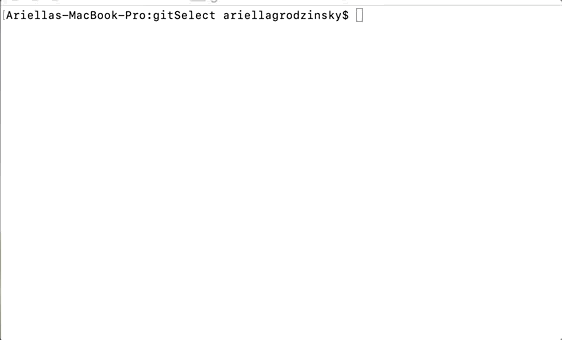

# ft_select

GOAL
-----
-----
To demonstrate the termcaps library by creating a basic interface with line edition that allows you to scroll through
a list of options passed in as arguments, select them with space, and delete them with backspace.

How to compile
--------------
--------------
- Clone the repo with ```git clone https://github.com/blairclair/ft_select.git```
- Cd into the name of the directory you just created with ```cd dirname``` replacing dirname with the name you've chosen
- Run ```make``` to compile the program with my makefile
- Run the excecutable with ```./ft_select arg1 arg2 arg3``` or whatever arguments you choose.

Example
-------
-------

